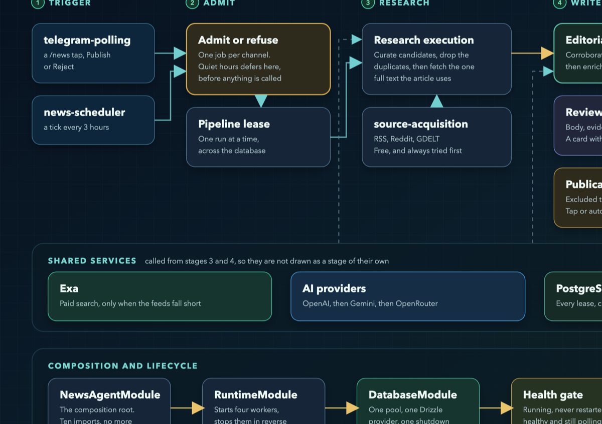

# Telegram News Agent

**An AI news desk that finds a story, checks it against independent sources,
writes a 200-word article and publishes it to Telegram — unattended, every three
hours, in production.**

<p align="center">
  <a href="docs/assets/nestjs-runtime-map.svg">
    <picture>
      <source srcset="docs/assets/nestjs-runtime-map.svg" type="image/svg+xml">
      
    </picture>
  </a>
</p>

**v2.0.0 in production since 2026-09-10** · TypeScript · NestJS · PostgreSQL ·
OpenAI / Gemini / Exa · Oracle Cloud ·
[live channel](https://t.me/HonestAINews) · [current status](docs/current-status.md)

## What it does

1. **Finds news** in a curated registry of RSS/Atom feeds, plus GDELT and
   Reddit, filtered to the topics the channel follows. Paid web search is used
   only when the free sources come up short.
2. **Chooses one story.** A model ranks the candidates, and a second pass
   rejects anything the channel has already covered.
3. **Reads the whole article**, not the feed snippet, and corroborates its key
   claims with a fact search limited to vetted, recent sources.
4. **Writes the post** to a fixed editorial shape — a headline and four
   paragraphs, 185–220 words, exactly one source link.
5. **Publishes it** — automatically, or after an editor taps *Publish* in a
   private Telegram chat — exactly once, even across crashes and restarts.

The whole desk is operated from Telegram: `/news`, `/settings`, `/stats`,
`/status` and `/labs`.

## What makes it interesting

### AI engineering

- **Grounded generation.** Every claim in a draft is mapped to the source that
  supports it, and the evidence map is stored with the draft. A draft that
  cannot be grounded fails closed instead of shipping.
- **One AI port, many providers.** Application code calls a single
  provider-neutral port. OpenAI, Gemini, OpenRouter and Exa are adapters behind
  it, tried in order with bounded retries, and a circuit breaker stops a
  rate-limited provider from being hammered — it exists because an early run
  sent 1,005 requests in six minutes.
- **Structured output, validated.** Model responses are parsed against schemas;
  an invalid one is a recorded failure with an error code, not a crash.
- **An editorial loop, not a single prompt.** Length and shape rules are checked
  after generation, and a draft that breaks them goes back to the model with
  exact feedback — *cut about twenty words, starting with the last sentence of
  the final paragraph* — rather than being thrown away. A lexical-overlap check
  rejects drafts that stay too close to their source.
- **Retrieval with limits.** Feeds first; paid search only for recovery and
  fact-checking. Corroborating sources must come from a vetted host list and be
  at most 72 hours old. Other outlets supply detail but are never named or
  linked in the post ([the article template](docs/article-template.md)).
- **Cost as a design constraint.** Every provider call is written to a usage
  ledger with tokens and an estimated price, and `/stats` shows the day's
  spend. The night pause refuses a scheduled run *before* any provider is
  called, so a quiet night costs nothing.

### Software engineering

- **A modular NestJS runtime** — 31 modules in four layers: database,
  persistence, application, transport and runtime. Ports and adapters with
  `Symbol`-token dependency injection. An architecture test fails the build on
  a layering violation, an import cycle or a `forwardRef`.
- **PostgreSQL owns concurrency.** Leases, `SKIP LOCKED` job claims,
  token-fenced updates and the publication claim live in atomic SQL functions.
  37 ordered, checksummed migrations; Drizzle for typed repositories, with a
  drift check against the SQL.
- **Idempotent publication.** An uncertain response from Telegram parks the
  draft for reconciliation instead of retrying, so a post is never published
  twice.
- **A strangler-fig migration, now serving production.** The system began as a JavaScript
  application and was rebuilt module by module in TypeScript while the old
  runtime kept serving production. Both runtimes ship in one image, the switch
  between them is one environment line, and the old one remains the rollback.

### Testing and delivery

- **900+ tests** across unit, application, persistence, architecture and runtime
  suites, 17 checks that boot the compiled build, and **18 end-to-end
  scenarios** that drive the whole `/news` flow against a real PostgreSQL with
  the AI, the feeds and Telegram faked — so a full run costs nothing.
- **Differential tests** run the legacy and the new publication code on the same
  fixture and compare every Telegram call and every database write.
- **Guards are proven by mutation.** Each important check is shown to go red
  when the behaviour it protects is removed.
- **Immutable, health-gated releases.** A version tag retags the image that
  already passed the full gate — it is never rebuilt — and the deploy succeeds
  only if the new container reports healthy three times in a row. Otherwise it
  restores the previous image and configuration by itself.
- **Secrets in the repository, encrypted** with SOPS and age. The decryption
  key exists only in CI.

## By the numbers

| Area | Figure |
| --- | --- |
| TypeScript runtime | 31 NestJS modules · 201 files · ~25,600 lines |
| Tests | 900+ test cases · 18 end-to-end scenarios · 17 compiled-build checks |
| Database | PostgreSQL 17 · 37 migrations |
| History | 157 merged pull requests since June 2026 |
| In production | v2.0.0 on the NestJS runtime since 2026-09-10 |

## The cutover to v2.0.0

The new runtime did not replace the old one on faith. It ran for two days on an
isolated integration stage — its own bot, channel, database and API keys — and
had to pass three behaviours it had never shown before:

| Behaviour | Result on the stage |
| --- | --- |
| Scheduled runs, unattended | 8 runs, one every three hours |
| Automatic publication | 7 of 8 published without a human; one lost to provider timeouts |
| Night pause | zero events between 22:00 and 08:00 Madrid, first run at 08:00:21 |

Then the production database was backed up and the backup was **restored into a
throwaway server and row-counted, table by table**, before anything changed. The
release went out as a tag, passed the health gate on the first attempt, and
production switched runtimes with the old one still in the image as the way
back. The whole procedure is in the [cutover runbook](docs/nestjs-cutover-runbook.md).

## Architecture

```text
DatabaseModule         one pool, one Drizzle provider, one owner of shutdown
  └─ persistence       nine domains; repositories never call each other
       └─ application  use cases and services; no SQL, SDKs or fetch
            └─ runtime four workers: polling, scheduler, news jobs, health
```

Research is split so the free path and the paid path stay separate, and the
editorial layer is split so fact-checking has its own budget. The module map,
the dependency rules and the remaining legacy seams are described in
[docs/architecture.md](docs/architecture.md#the-nestjs-module-structure).

## Tech stack

| Area | Tools |
| --- | --- |
| Runtime | Node.js 22, TypeScript, NestJS 11 (standalone application context) |
| Data | PostgreSQL 17, Drizzle ORM, ordered SQL migrations |
| AI | OpenAI, Google Gemini, OpenRouter, Exa search and content, Zod-validated structured output |
| Messaging | Telegram Bot API, long polling |
| Delivery | Docker Compose on an Oracle Cloud VM, GitHub Actions, multi-arch images on GHCR, SOPS + age |
| Audit | Notion "Agent Runs" log with a PostgreSQL outbox fallback |

## How it is built

The project is developed with AI coding agents under a strict, human-owned
process: every change starts as a ticket, lands as a small pull request with its
own tests, and merges only on a green CI gate. Anything that touches production
— a release, a backup, a secret — needs an explicit decision from the owner.
The process is written down in [docs/engineering-workflow.md](docs/engineering-workflow.md).

## Run it locally

Node 22 or newer, and Docker for the database-backed suites.

```bash
npm ci
npm test               # legacy unit tests
npm run typecheck
npm run test:application
npm run test:e2e       # whole /news flow, real PostgreSQL, providers faked
```

Configuration starts from `.env.example`. Running the bot, the Telegram admin
workflow, the source registry, publishing and deployment are covered in
[docs/operations.md](docs/operations.md).

## Documentation

| Document | What it covers |
| --- | --- |
| [Operations](docs/operations.md) | Running and operating the bot: configuration, Telegram controls, research, publishing, deployment |
| [Architecture](docs/architecture.md) | Components, the NestJS module structure and the legacy seams |
| [Article template](docs/article-template.md) | The editorial shape every post follows, and why |
| [Releases](docs/releases.md) | Tags, release branches, and what a tag actually deploys |
| [Cutover runbook](docs/nestjs-cutover-runbook.md) | Switching runtimes, and rolling back |
| [Cutover readiness](docs/nestjs-cutover-readiness.md) | What was verified before the switch |
| [Integration stage](docs/integration-stage.md) | The isolated test stage, used only for tests |
| [Oracle deployment](docs/oracle-deployment.md) | Server, secrets and the deployment lifecycle |
| [Current status](docs/current-status.md) | The verified production snapshot and known issues |

## Roadmap

1. Keep scheduled runs from failing when every candidate article's page is
   blocked to extraction — in progress.
2. Restore a second AI provider in production.
3. After the soak period, retire the legacy runtime. Five seams still reach it,
   so that is porting work first — [ticket 0006](tickets/0006-retire-legacy-runtime.md).
