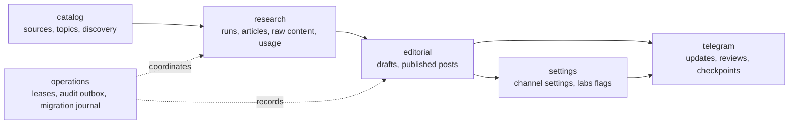

# Drizzle database migration

## Decision

The project is adopting Drizzle incrementally. PostgreSQL SQL migrations remain
the source of truth during the transition. Drizzle provides the typed schema
snapshot and will become the query layer one repository at a time.

Drizzle fits this project for three reasons:

1. It stays close to PostgreSQL and SQL. The existing atomic functions, RLS,
   constraints, partial indexes, and checksum-based migration runner do not
   need to be replaced.
2. It gives the future NestJS modules typed tables and query results while
   continuing to use the existing `pg.Pool` connection model.
3. It supports a vertical-slice migration. Sources, settings, research,
   editorial, and Telegram persistence can move independently without a
   big-bang rewrite or a production outage.

The trade-off is that the schema has two representations: executable SQL and
Drizzle TypeScript. CI therefore runs a live drift check. For now, SQL is
authoritative when the representations disagree.

## Current safety boundary

The first slice does not change the production query path. The working bot and
all PostgreSQL functions still run through the existing `pg` repositories.

- `db/migrations/*.sql` changes PostgreSQL.
- `scripts/migrate.mjs` applies migrations under an advisory lock, records a
  SHA-256 checksum, and refuses modified history.
- `src/database/schema/*.ts` describes the current 20 application tables plus
  `schema_migrations`.
- `scripts/schema-drift.ts` compares a migrated PostgreSQL database with the
  Drizzle snapshot: tables, columns, SQL types, nullability, foreign keys, RLS,
  and every explicitly declared Drizzle index.
- PostgreSQL functions, function bodies, grants, policies, check expressions,
  default expressions, and implicit constraint indexes remain covered by the
  SQL migrations and integration tests rather than the drift inspector.

The foundation deliberately does not add `drizzle-kit`. The latest checked
version (`0.31.10`) brought moderate development-only audit findings through
deprecated esbuild-kit dependencies. The project keeps its audited custom SQL
runner and can reconsider Drizzle Kit when that dependency chain is clean.

## Schema and data-flow groups

The following arrows describe foreign-key/data relationships and a safe rollout
order. They are **not** NestJS module imports and do not authorize repositories
to call one another. The target NestJS import and orchestration contract is
defined in `docs/nestjs-drizzle-migration-blueprint.md`; application services
coordinate narrow repositories from these groups.



The data direction is intentional: transport and configuration rows may
reference editorial state, but research and editorial business logic do not
import Telegram behavior.

## Migration workflow

Create a uniquely timestamped migration:

```bash
npm run database:new -- add_story_relationships
```

Then:

1. Write the PostgreSQL change in the new SQL file. Never edit an applied
   migration.
2. Update the matching Drizzle table declaration.
3. Run the local static checks:

   ```bash
   npm run typecheck
   npm run test:drizzle
   npm test
   ```

4. Apply migrations to a disposable or staging database and compare it:

   ```bash
   DATABASE_URL=postgresql://... npm run database:migrate
   DATABASE_URL=postgresql://... npm run database:drift
   ```

5. Inspect migration history before release:

   ```bash
   DATABASE_URL=postgresql://... npm run database:status
   ```

`database:status` reports `applied`, `pending`, `changed`, and
`missing_locally`. A changed or missing local migration exits unsuccessfully.

## Delivery roadmap

### Slice 1: database foundation

- Add the Drizzle schema snapshot and typed client factory.
- Keep the current runtime unchanged.
- Add migration creation/status commands and CI drift detection.
- Add the two missing partial indexes for nullable foreign keys.

### Slice 2: sources repository

- Status: parallel typed implementation complete; production wiring remains
  intentionally off until the foundation is reviewed and merged.
- Introduce a `SourcesRepository` interface.
- Move source listing and source-health queries to Drizzle.
- Keep atomic discovery and health functions in SQL and call them through the
  repository.
- Run old and new repository integration tests against the same database.

### Slice 3: settings repository

- Move settings and labs reads to Drizzle.
- Preserve optimistic versions and atomic scheduling functions in PostgreSQL.
- Keep Telegram callback behavior unchanged.

### Slice 4: research and editorial repositories

- Separate article ingestion, usage accounting, drafting, review, and
  publication persistence.
- Preserve the current publication state machine and idempotency functions.

### Slice 5: NestJS application shell

- Add `DatabaseModule`, `SourcesModule`, `ResearchModule`, `EditorialModule`,
  `SettingsModule`, and `TelegramModule` around the already separated
  repositories.
- Start one Nest application process with explicit dependency injection and
  lifecycle hooks.

### Slice 6: community features

- Add reactions, daily polls, and preference signals as independent modules.
- Consume published-post IDs and editor identities through stable interfaces;
  do not couple community scoring to Telegram update handlers.

Each slice gets its own PR, clean-database integration run, and rollback point.
The runtime only switches after the corresponding repository is verified.
