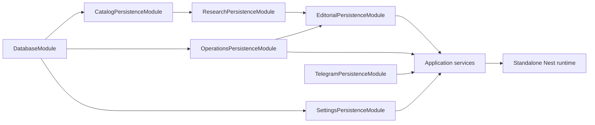

# NestJS and Drizzle migration blueprint

Status: Drizzle persistence and legacy-facade parity are complete. Reversible
NestJS application services now cover Usage, Settings, Catalog/Research,
Operations and Editorial; production composition and entrypoints remain legacy.

Notion Epic: [Engineer Telegram News Agent into a modular NestJS platform](https://app.notion.com/p/3b7d78850eab81348bcbec541f1c23bb)

## Outcome

Replace the monolithic persistence and runtime composition incrementally with typed repositories, NestJS application modules, and one standalone Nest application context. Preserve current production behavior and keep every slice independently testable and reversible.

This is a query-layer and composition-root migration. It does **not** copy production data, replace PostgreSQL, expose the database publicly, create an HTTP server, or migrate the Oracle host. Oracle A1 migration remains a separate operations change.

## Verified baseline

The baseline audit found:

- 23 PostgreSQL tables: 22 application tables plus `schema_migrations`.
- 23 foreign keys in the Drizzle schema snapshot.
- 49 current PostgreSQL function names and 51 live signatures.
  `update_news_settings` and the publication-claim function each intentionally
  retain one compatibility overload. A clean PostgreSQL 17 inventory corrected
  the earlier static count and remains authoritative for both overloads. The
  excluded-topic foundation adds one validator and one dedicated optimistic-CAS
  update without changing either `update_news_settings` signature.
- 69 domain persistence methods and six infrastructure helpers in `NewsRepository`.
- 31 domain paths suitable for typed Drizzle queries and 38 paths that should retain a PostgreSQL function as their atomic boundary.
- Five public methods with no production call sites: `createDraft`,
  `recordPublication`, `transitionArticle`, `transitionDraft`, and
  `replaceArticleTopics`. They remain facade compatibility methods, not new
  application ports; `createReviewDraft` now owns atomic topic assignment.
- `CatalogPersistenceModule` exposes all eleven source/catalog methods through
  its narrow token, including the typed article-tag catalogue read.

These counts are verified by the executable clean PostgreSQL 17 contract.
Ordered SQL migrations and live PostgreSQL introspection remain authoritative.

## Data ownership

| Module | Tables | Responsibility |
| --- | --- | --- |
| Catalog | `sources`, `topics`, `source_topics`, `topic_translations`, `source_discovery_state` | Source registry, health, discovery and tag catalogue |
| Research | `search_runs`, `articles`, `raw_contents`, `article_topics`, `ai_usage_events` | Candidate ingestion, evidence, classification and provider usage |
| Editorial | `drafts`, `published_posts` | Draft review, publication state and receipts |
| Story deduplication | `article_story_decisions`, `story_publication_claims` | Cross-run story memory, semantic relation audit and race-safe publication reservation |
| Settings | `news_bot_settings`, `news_feature_flags`, `telegram_settings_inputs` | Channel configuration, experiments and settings input |
| Telegram | `telegram_updates`, `telegram_review_sessions`, `telegram_news_request_checkpoints` | Update idempotency, review controls and resumable `/news` requests |
| Operations | `pipeline_leases`, `notion_audit_outbox` | Cross-process ownership and durable audit delivery |
| Technical | `schema_migrations` | Applied migration checksums and history |

Foreign keys do not define application dependency direction. Repositories do not call one another; application services coordinate them.



## Target boundaries

### DatabaseModule

- Provide exactly one `pg.Pool` token and one Drizzle database token.
- Provide a protected `RepositorySupport` for stable error wrapping and named PostgreSQL-function calls.
- Own idempotent pool shutdown after polling and scheduling have stopped.
- Prove with a standalone application-context test that repeated start/stop does not leak connections.
- Keep dynamic table-name insert/update helpers out of public contracts.

### Persistence modules

- `CatalogPersistenceModule`: source and topic catalogue persistence.
- `OperationsPersistenceModule`: `PipelineLeasesRepository`,
  `NotionAuditOutboxRepository`.
- `ResearchPersistenceModule`: search-run, article and raw-content persistence.
- `StoryDeduplicationPersistenceModule`: recent publication memory and durable story decisions.
- `EditorialPersistenceModule`: draft and publication persistence.
- `UsagePersistenceModule`: AI usage writes and reporting reads.
- `SettingsPersistenceModule`: `NewsSettingsRepository`,
  `FeatureFlagsRepository`, `TelegramSettingsInputRepository`.
- `SchedulerPersistenceModule`: schedule claim/checkpoint persistence.
- `TelegramPersistenceModule`: update, review-session and checkpoint persistence.

Each module exposes narrow interfaces and injection tokens. While JavaScript consumers remain, adapters explicitly map Drizzle camelCase records to the existing snake_case DTO shape.
Persistence module classes end in `PersistenceModule`; new application modules
end in `ApplicationModule`; transports end in `TransportModule`. The legacy
facade imports persistence modules only.

### Application services and adapters

- `ResearchService` coordinates source collection, ranking, extraction and AI providers.
- `EditorialWorkflowService` exposes grounded review-draft generation,
  approved publication and operator reconciliation through one Symbol-backed
  application port. Its publication use case keeps PostgreSQL claim/finalize/
  release/reset functions authoritative and evaluates a Symbol-bound excluded-
  topic policy against current settings and the exact outbound text immediately
  before the transport-neutral publication gateway. Provider, policy and send
  adapters are deliberately not wired into the current runtime; durable policy
  audit/rejection and enforcement across every live send path remain the
  separate final-veto slice.
- `SettingsService` owns validated channel configuration and Labs flags.
- `SchedulerService` owns due-work orchestration and quiet-hours recovery.
- `PipelineLeaseService` exposes acquire, renew and release without moving
  owner fencing or server-time semantics out of PostgreSQL.
- `NotionAuditDeliveryService` enqueues and sequentially replays the durable
  audit outbox through a Symbol-bound outbound gateway. Claim ordering,
  `SKIP LOCKED`, completion and retry/backoff remain PostgreSQL-owned.
- Telegram is a transport adapter. Research and editorial core code do not import Telegram.
- OpenAI and Gemini remain behind the existing AI-provider interface.
- The first Nest runtime uses `createApplicationContext`; no HTTP listener is added.

## Atomic PostgreSQL boundary

Retain PostgreSQL functions for operations involving locks, leases, `SKIP LOCKED`, optimistic versions, token-based compare-and-set, server-side time, multi-table transitions, scheduling claims, review decisions, publication idempotency, or durable queue claims.

The retained groups include:

- source health and discovery claims;
- article candidate creation and topic replacement;
- review-draft creation, approval and rejection;
- publication claim, finalize, reset and rejected-release recovery;
- pipeline lease acquire, renew and release;
- settings creation/update, dedicated excluded-topic update, and feature-flag
  version CAS;
- schedule claim, checkpoint, renewal, quiet-hours deferral and completion;
- Telegram update claims and review-session decisions;
- Notion audit-outbox claim, completion and retry.

Drizzle may execute these functions through typed wrappers. Moving a function into application transactions requires a separate parity proof and review; it is not part of this Epic by default.

## Compatibility contract

Every slice preserves:

- legacy snake_case DTOs, null semantics, timestamps, bigint handling and error wrapping;
- canonical-URL idempotency and one active draft per article;
- atomic manual approval, rejection, publication claim and receipt recovery;
- manual `/news`, manual Publish and review-required defaults;
- OpenAI-primary generation and Gemini fallback;
- database-backed 1h/3h/6h/12h/24h schedules;
- 22:00-08:00 `Europe/Madrid` quiet hours, including checkpointed morning recovery;
- Telegram update idempotency, review sessions and Notion audit outbox;
- exactly one active Telegram poller.

Do not compare writes by dual-writing production. Mutation parity runs only on isolated, resettable integration fixtures. Read parity may run in CI.

## Executable database-contract gate

Before repository migration resumes, CI must create a clean PostgreSQL 17 database and produce a machine-readable inventory that verifies:

- all 23 tables and 23 foreign keys;
- columns, PostgreSQL types, nullability and defaults;
- primary, unique and check constraints;
- expected and unexpected indexes, including partial indexes;
- 49 function names, 51 signatures, return types, volatility, security mode and
  configured search path; the two compatibility overloads for settings update
  and publication claim remain present alongside the excluded-topic validator
  and dedicated update function;
- function-body checksums or normalized definitions;
- RLS state, policies, grants and revoked public access;
- migration idempotency: apply the ordered migrations twice, then require every local migration to report `applied` and no unexpected object drift.

The existing Drizzle drift test remains useful but is insufficient for this gate because it does not cover every PostgreSQL object above.

## Ordered delivery slices

```text
Blueprint + executable database contract
  -> DatabaseModule and shared repository support
    -> Catalog repositories
    -> Operations repositories
    -> Settings configuration repositories
  Catalog -> Research ingestion repositories
  Research -> Editorial repositories
  Research -> Usage and reporting repository
  Operations + Editorial + Settings -> Scheduler state machine repository
  Editorial + Settings -> Telegram control and checkpoint repositories
  All repository slices -> Legacy facade parity
  Facade parity -> Nest application services and transport adapters
  Application services -> Standalone Nest composition root
  Runtime -> Production cutover
  Cutover soak -> Retire legacy runtime
  Retirement or explicit follow-up -> Epic retrospective
```

One implementation slice normally maps to one Notion ticket, one `codex/*` branch, one pull request and one independent closure review. A ticket becomes `Ready` only when every `Depends On` relation is terminal and successful.

## Verification matrix

| Gate | Required evidence |
| --- | --- |
| Static | `npm run typecheck`; dependency-cycle test; no direct runtime `pg` outside persistence adapters |
| Unit | Existing `npm test` plus module/service tests for success, failure and recovery paths |
| Schema | `npm run test:drizzle`; full executable database-contract check |
| Repository | Old/new reads on identical fixtures; isolated mutation parity; snake_case/error/null/timestamp/bigint checks |
| Clean database | Apply migrations twice; run all repository and integration suites on PostgreSQL 17 |
| Build | Compile emitted `dist`; runtime image contains no TypeScript runner or development dependencies |
| Container | Start/stop smoke; database readiness; scheduler start; Telegram identity/polling mode check |
| Shutdown | SIGTERM completes in less than Docker `stop_grace_period=45s`, stops scheduler/poller, releases leases and closes the single pool |
| Production | Manual `/news`, review-required Publish, scheduled run, quiet-hours deferral/recovery, audit outbox and usage dashboard |

## Cutover and rollback

Before cutover:

1. Merge only a reviewed immutable commit with green CI.
2. Create and verify a `pg_dump`; rehearse `pg_restore` into an isolated database.
3. Prove the N-1 container image remains compatible with the post-migration schema.
4. Stop the old poller before starting the new poller; never overlap Telegram polling.
5. Require readiness to include a database query, Telegram bot identity and polling-mode check, polling lease acquisition, scheduler initialization and observable process health.

Rollback triggers include failed readiness, duplicate polling, state-machine parity errors, database-contract drift, publication idempotency failure, unbounded restart, or missed scheduler recovery. Roll back the immutable application image first when schema compatibility permits. Restore data only from a verified backup under a separately authorized incident action.

The legacy entrypoint remains for at least one release and is removed only after several manual and scheduled cycles complete without parity errors. SQL compatibility overloads are not removed in the same pull request.

## Known risks

| Risk | Control |
| --- | --- |
| Drizzle and SQL schema drift | SQL remains authoritative; clean-database contract gate |
| Lost atomicity | Keep state-machine functions in PostgreSQL |
| Hidden legacy consumers | Call-site inventory, temporary facade and compatibility tests |
| Circular Nest modules | Repositories never call repositories; static dependency test |
| Duplicate Telegram polling | Lease plus explicit one-poller cutover gate |
| Rollback image cannot read new schema | N-1 smoke against post-migration schema |
| Connection leak or shutdown race | One pool owner and repeated application-context lifecycle test |
| Tool-derived false confidence | Verify Graphify against source, SQL, tests and PostgreSQL introspection |

## Decision log

- Drizzle is the typed query layer; it is not the migration authority.
- NestJS supplies dependency injection, lifecycle management and module boundaries; the initial runtime is not an HTTP service.
- PostgreSQL remains the concurrency and state-transition authority during this Epic.
- Graphify remains an advisory navigation tool for the Epic and is reevaluated at the retrospective.
- Production and Oracle-host changes require separate explicit user authority.
