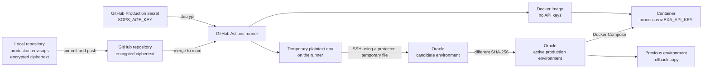
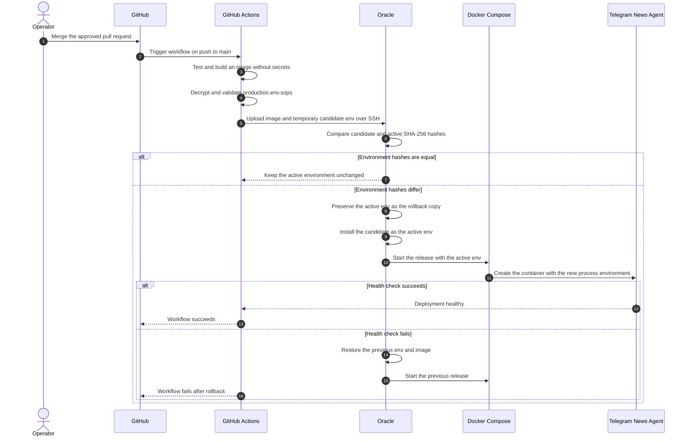
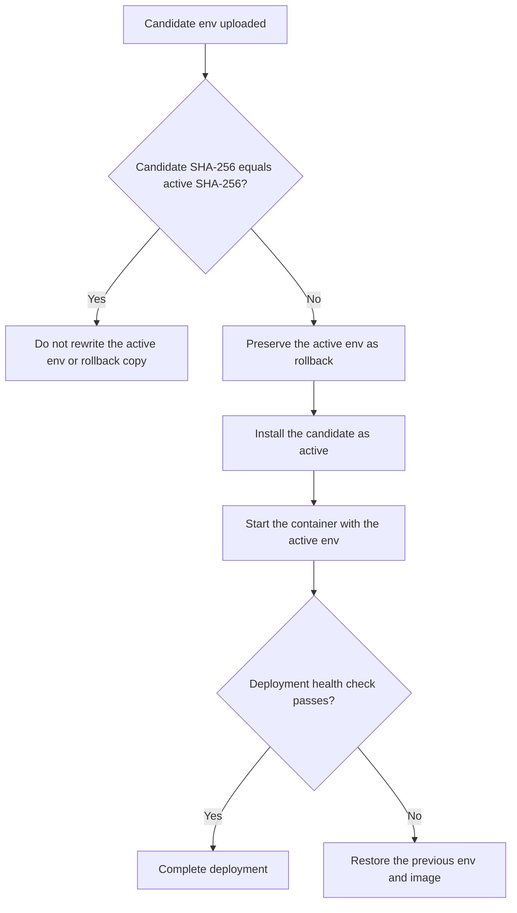

# Production Secret Rotation and Deployment Flow

This document explains how production secrets are edited locally, stored with
SOPS, reviewed in GitHub, transferred to Oracle, applied to Docker containers,
verified, and rolled back.

## Mental model

Docker images and production secrets are separate deployment inputs:

```text
Docker image       = application code and runtime dependencies
Production env     = configuration and secrets
Running container  = Docker image + environment injected at startup
```

API keys are never baked into the Docker image. The application reads them from
its process environment, for example `process.env.EXA_API_KEY`.

## Where a secret exists



At rest, the repository contains only SOPS ciphertext. GitHub Actions can
decrypt it because the private age identity is stored as `SOPS_AGE_KEY` in the
GitHub Production Environment. Plaintext exists only temporarily on the runner,
in the protected active environment file on Oracle, in its protected rollback
copy, and in the running container's process environment.

The legacy GitHub `EXA_API_KEY` and `OPENAI_API_KEY` secrets are retained as
rollback-only credentials. The normal SOPS deployment does not read them.

## Rotating `EXA_API_KEY`

### 1. Create a replacement key

Create a new key in Exa but do not revoke the old key yet. Keeping both keys
active preserves the ability to roll back safely.

Exa also provides an API for creating named keys with an optional rate limit:
<https://exa.ai/docs/reference/team-management/create-api-key>.

### 2. Create a rotation branch

Start from an up-to-date and clean `main` branch:

```bash
git status --short --branch
git switch main
git pull --ff-only
git switch -c codex/rotate-exa-key-YYYY-MM-DD
```

Do not continue if `git status` shows unrelated local changes. Preserve or
resolve those changes before switching branches.

### 3. Edit the encrypted production environment

Run:

```bash
EDITOR="code --wait" ./ops/sops-production-env.sh edit
```

SOPS opens a temporary decrypted view in VS Code. Find `EXA_API_KEY`, replace
only its value, press `Cmd+S`, and close the tab opened by the command.

- Saving without closing leaves the terminal command waiting.
- Closing without saving discards the new value.
- Saving and closing causes SOPS to encrypt the file again before the command
  returns.

The committed file remains encrypted.

### 4. Validate the encrypted file

Run:

```bash
./ops/sops-production-env.sh validate
git status --short
```

The validator checks required variables, duplicate definitions, SOPS
encryption, and known placeholder values without printing secret values.

For a key-only rotation, the intended repository change is:

```text
secrets/production.env.sops
```

### 5. Commit, push, and open a pull request

The order is edit, validate, commit, push, and then create the pull request:

```bash
git add secrets/production.env.sops
git commit -m "chore: rotate Exa API key"
git push -u origin HEAD
gh pr create --fill
```

GitHub cannot see which plaintext value changed. It only sees that the encrypted
`secrets/production.env.sops` file changed. Opening a pull request does not
change production.

## What happens after merge

A merge creates a new commit on `main`. The `push` event starts the production
workflow in `.github/workflows/deploy.yml`.



The Oracle host does not watch GitHub and does not pull secrets by itself.
GitHub Actions initiates the deployment, connects to Oracle over SSH, uploads
the candidate files, and runs `ops/deploy.sh` remotely.

## How Oracle detects a secret change

Oracle does not identify a specific variable such as `EXA_API_KEY`. The deploy
script compares the SHA-256 hash of the complete candidate environment file
with the complete active environment file.



The hashes are computed from the files during deployment. Secret values and
hash inputs are not printed. Equal hashes prevent unnecessary environment
rewrites and prevent overwriting a valid rollback copy.

## How the new key reaches the application

Changing the active file alone cannot change the environment of an already
running process. The deployment starts the service through Docker Compose with
the active production environment. The newly created container receives the
new `EXA_API_KEY`, and Node.js exposes it as `process.env.EXA_API_KEY`.

The workflow may build a new image as part of the release, but the key is not
inside that image. The same image can be started with different environment
files.

## Verification evidence

GitHub Actions can safely show that:

- SOPS decryption succeeded.
- Production environment validation passed.
- The environment was changed or left unchanged based on its hash.
- The candidate was installed on Oracle.
- The container started and passed its health check.
- A failed release restored the previous environment and image.

Secret values must never appear in logs, pull requests, issues, documentation,
or Docker image layers.

The general application health check proves that the service started, but it
does not by itself prove that Exa accepted the replacement key. Full provider
verification requires a minimal authenticated Exa smoke request that reports
only success or failure. Until that check is automated, perform a bounded
post-deployment Exa operation before revoking the previous key.

## Safe revocation and rollback window

Use this order:

1. Create the replacement Exa key.
2. Keep the previous key active.
3. Update and validate the SOPS file.
4. Merge and deploy the replacement key.
5. Verify an authenticated Exa operation.
6. Keep the previous key for the agreed rollback window.
7. Revoke the previous key only after the release is stable.

If the previous key is revoked before verification, an automatic rollback can
restore the previous environment file but cannot make the revoked key valid
again.

## PostgreSQL credentials are a special case

The PostgreSQL administrative and application passwords are also stored in the
SOPS environment, but their usernames are fixed by the deployment configuration:

- `postgres` is the administrative database user. Its password is
  `POSTGRES_PASSWORD`.
- `telegram_news_app` is the restricted runtime user. Its password is
  `POSTGRES_APP_PASSWORD`.

Database password rotation additionally requires reconciling the actual
PostgreSQL role password before the application starts. API-key rotation does
not modify the database.

